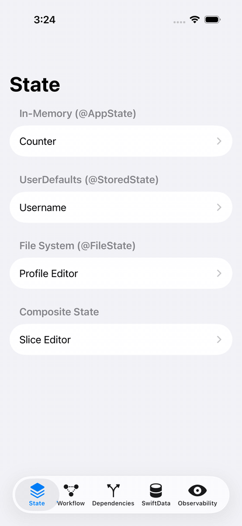

# SwiftUIDemo — AppState 3.0 Catalog App

A SwiftUI catalog for iOS 17+ and macOS 14+ that demonstrates AppState 3.0 as both focused API examples and one
cohesive delivery workflow.



## Getting started

```bash
cd apps/SwiftUIDemo
xcodegen generate
open SwiftUIDemo.xcodeproj
```

Use `SwiftUIDemo-iOS` for the iOS app and its UI/snapshot tests. Use `SwiftUIDemo-macOS` for the native macOS app and
the shared seven-test model/AppState integration suite.

## The integrated workflow

The **Workflow** tab goes beyond a one-wrapper-per-screen sample. One user journey coordinates:

- `@AppState` collection state for five delivery tasks and a bounded activity timeline
- derived completion counts and progress from the composite `DeliveryBoard`
- `@StoredState` for the auto-analysis preference
- an async, `Sendable` `BoardAnalyzing` service resolved through `@AppDependency`
- immutable collection transformations that update multiple views from the same source of truth
- deterministic launch configuration for repeatable UI automation

Complete tasks, inspect cross-state activity events, ask the injected analyzer for the next stage, toggle persisted
automation, and reset the whole flow from one screen.

## Catalog coverage

| Tab | Examples |
| --- | --- |
| State | `@AppState`, `@StoredState`, `@FileState`, `@Slice`, and `@OptionalSlice` |
| Workflow | Composite state, persistence, derived values, async dependency injection, and collection mutations |
| Dependencies | `@AppDependency`, runtime overrides, `@ObservedDependency`, Keychain, and iCloud links |
| SwiftData | `@ModelState`, `@Query`, lenient/strict insertion, deletion, and bulk deletion |
| Observability | `withObservationTracking`, explicit re-arming, a shared counter, and a live event log |

`HeadlessObserver` uses Observation directly to subscribe and re-arm outside the SwiftUI view lifecycle. It is marked
`@Observable` only so SwiftUI can render its log; the subscription itself does not use `ObservableObject` or Combine.

## Verification

Run the full iOS proof suite from the repository root:

```bash
fledge run test-swiftui
```

That scheme runs:

- ten fixed-size image-regression snapshots spanning workflow, state, slices, dependencies, secure/sync state, and dark mode
- fourteen end-to-end UI journeys for workflow coordination, dependency overrides, every persistence wrapper,
  SwiftData add/toggle/delete paths, and observation lifecycle behavior
- seven fast model and dependency tests for branch-heavy logic that image tests should not infer
- a visual-evidence journey that captures five ordered frames used by the repository GIF

The baselines live in `SnapshotTests/__Snapshots__`. Curated UI-test frames live in `docs/assets/swiftui`. Rebuild the
proof animation after refreshing those frames with:

```bash
fledge run evidence
```

UI tests launch with `--ui-testing`, which resets AppState values, persisted preferences, and SwiftData to deterministic
in-memory state without changing normal app launches.

Run the measured production-target gate with `fledge run coverage-swiftui`. The latest full run covered 98.89% of
`SwiftUIDemo.app`; CI rejects results below 95%.
